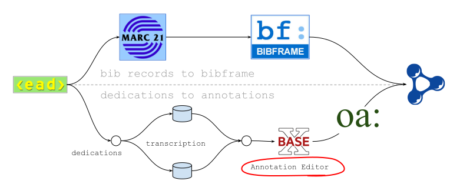
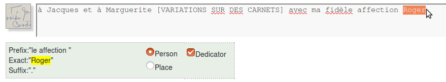
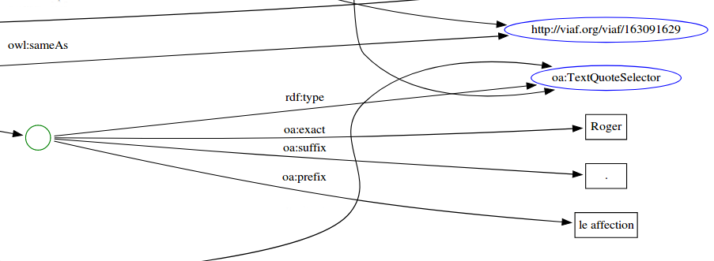

# Annotation Editor

### What
A simple webapp to help us create annotations from transcribed inscriptions, like a primitive Named Entity Recognition tool.

This is the second iteration of the app, which was originally created by [Tim Thompson](https://github.com/timathom) while he was at Princeton. Never intended for reuse, even locally, it's emergency MacGyverware developed fully within our Technical Services Department at PUL to expedite progress on a time-sensitive project (LD4P 2016-2018) and is presented here for posterity and informational purposes. More about the grant and our project can be found on the [LD4P wiki](https://wiki.duraspace.org/display/LD4P/Princeton+-+Project+Updates).

Our _preliminary_ data model is based on W3C Web Annotations. We "tagged" people, places, and dates within the inscriptions by means of [oa:TextQuoteSelector](https://www.w3.org/TR/annotation-model/#text-quote-selector).  You can read about our early decision-making process here:
* Timothy A. Thompson, et al. (2016). From Notes to Annotations: Deconstructing Dedications in the Library of Jacques Derrida at Princeton University, _Journal of Library Metadata, 16_(3-4), 146-165. [doi:http://dx.doi.org/10.1080/19386389.2016.1258908](http://dx.doi.org/10.1080/19386389.2016.1258908)

A complete working version of our model and dataset will be posted in more detail at the conclusion of the grant, by mid-2018.

### Where
It ran on a private server at PUL, so there's no live demo available (sorry), but see the "How" section below for a screencast and the how-to doc.

### Why
We were unable to identify readily available (and preferably free) tools for our purpose at the time (early 2018), and we didn't want to do all of the work by copying and pasting into text editors and browsers. We also saw pedagogical value in working with raw ttl to some degree. XML may be socially unattractive, but we found XForms to be pretty useful in a pinch.



**Figure 1.** Where the editor fit into our overall project (dedications were double-blind transcribed) 

### How
Starting with metadata for 450 items from Derrida's library with hand-written dedications in them, we divided the list amongst 11 staff and used the editor to manually "tag" the people, places, and dates within the transcribed inscriptions during a two-day "annotation blitz". Each resulting annotation was appended to a pre-generated template, which included a tie-in to BIBFRAME 2.0 descriptions of each title.

The ttl existed on the file system (see the directory tree below). Each edit triggered the generation of a visualization (using inotify and Graphviz). 



**Figure 2.** Tagging a person, in this case the dedicator, in an transcribed dedication. The prefix and suffix were selected automatically.
```
...
oa:hasSelector  [ a oa:TextQuoteSelector ;
                   oa:prefix  "le affection " ;
                   oa:exact   "Roger" ;
                   oa:suffix  "."
          	    ] ;
         owl:sameAs <http://viaf.org/viaf/44301265> ;
...
```
**Figure 3.** Corresponding excerpt from the resulting ttl. 



**Figure 4.** And the corresponding excerpt from the visualization.
```
...
   <annotation>
      <id>001</id>
      <link>c3849</link>
      <imageid>b_000115/08</imageid>
      <title>Laporte. Variations sur des carnets.</title>
      <name>Laporte</name>
      <rightperson>Laporte, Roger</rightperson>
      <idloc>http://id.loc.gov/authorities/names/n50036015</idloc>
      <viaf>http://viaf.org/viaf/44301265</viaf>
      <vendornote>Contains annotations. Inscribed copy. Dealer note: Très rares annotations et plusieurs pages cornées. Catalogue de l'éditeur inséré. Check-in observation: Inscribed by author. Dog-eared pages 52, 112, 195, 232, 247, 254.</vendornote>
      <inscription>à Jacques et à Marguerite [VARIATIONS SUR DES CARNETS] avec ma fidèle affection Roger.</inscription>
      <bibid/>
      <oclcid>45697835</oclcid>
      <owi>http://worldcat.org/entity/work/id/35875770</owi>
   </annotation>
 ...

```
**Figure 5.** The underlying XML for this title. All elements were available through the editor interface. "rightperson" is the authorized form of the author's name. When titles were part of the inscription, they were transcribed in `[UPPERCASE WITHIN BRACKETS]`.

* [Silent screencast (YouTube)](https://youtu.be/DpevKe26YuE)(3:32)
  * with a preview of how the results might look in a modified [Sparqlight](https://github.com/sul-dlss/sparqlight/tree/bibframe2)
* Our [How-to](https://docs.google.com/document/d/1516Kiy9h-_uTwUweMLKXHEadeCPggaOk2uohWxOqb6A/edit?usp=sharing) document
* See the `./ttl` directory above for an example of the resulting ttl

##### How we set it up (if you really want to know)

* Installed basex in `/opt/local`
* Went to the basex directory with `cd /opt/local/basex`
* Started basex `./bin/basexhttp`
* Went to http:localhost:8984/dba
* Entered the username and password
* Created a new database called jd
* Added reconciled dedications `anno.xml` with the path `anno/anno.xml` (typing that in to "Path (optional) field")
* Went to http:localhost:8984/annotation
* Output went to `./basex/static/anno/` as ttl, svg and html files. Example ...
  * 1.ttl - the turtle file (in the ttl folder above)
  * 1.svg - graphviz graph
  * 1.html - an interactive graph, based on the svg above

NOTE: Data originated from EAD in a finding aid and because the `ead:unitid` types differed, annotation ids were eventually generated as AutoNumbers in MS Access.

Customization for this second iteration of the app focused on these two files:
* `/opt/local/basex/webapp/static/editor/annotation.xml`
* `/opt/local/basex/webapp/anno/modules/annotate.xqm`

The directory tree ...
```
# within /opt/local/basex/

webapp
├── anno
│   └── modules
│       └── annotate.xqm	<= this is the xquery module
└── static
    ├── anno	<= all of the output is in here (.ttl, .svg, .html)
    └── editor 
        └── annotation.xml	<= this is the form itself
```
 
##### Requirements
* java 7+
* [basex](http://basex.org/products/download/)

##### Extras
* [jquery.graphiz-svg](https://github.com/mountainstorm/jquery.graphviz.svg/) - for generating interactive visualizations
* [inotify](http://man7.org/linux/man-pages/man7/inotify.7.html) - for automatically (re)generating visualizations after each edit
